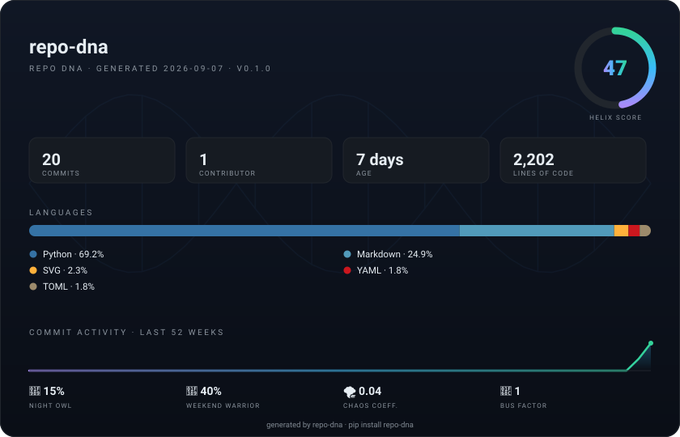

<div align="center">



# 🧬 repo-dna

**你的 git 提交历史就是一次人格测试，repo-dna 就是那台扫描仪。**

一条命令 · 零依赖 · 代码永不离机

[](https://pypi.org/project/repo-dna/)
[](https://pypi.org/project/repo-dna/)
[](#faq)
[](.github/workflows/ci.yml)
[](LICENSE)

[快速开始](#-快速开始) · [指标解读](#-指标解读) · [JSON 模式](#-json-模式) · [FAQ](#faq)

*上面这张卡片是真实生成的——repo-dna 扫描了它自己。English version: [README.md](README.md)。*

</div>

---

每个仓库都有自己的性格。有的是凌晨两点的咖啡因冲刺，有的被一整队维护者精心呵护，还有的 90% 都是 YAML、纯纯的混乱。

**repo-dna** 读取你的 git 历史，告诉你这个项目**到底是什么**，再递给你一张可以直接放进 README 炫耀的精美卡片。

- 🧬 **Helix 评分** —— 一个数字概括整个基因组（0–100，玄学但可复现）
- 🚌 **巴士系数** —— 挂掉几个人，项目才停摆
- 🦉 **夜猫子指数** & 🎉 **周末战士** —— 工作到底是在什么时候发生的
- 🌪️ **混沌系数** —— 删除行 ÷ 新增行，一个侵略性指标
- 🔥 **热点文件** —— 战况最激烈的文件
- 🖼️ **可分享 SVG 卡片** —— 深色渐变，为 README 而生

## 🚀 快速开始

```bash
pip install repo-dna        # 或者: pipx install repo-dna · uvx repo-dna
repo-dna .
```

就这么多。没有配置文件、没有 API token、不用注册账号。任何 git 仓库都能扫：

```bash
repo-dna ~/my-project
repo-dna ~/dotfiles --svg card.svg      # 顺便生成可分享卡片
```

<details>
<summary><b>不想装？直接源码运行</b></summary>

```bash
git clone https://github.com/YOUR_USERNAME/repo-dna
cd repo-dna
PYTHONPATH=src python -m repo_dna .
```
</details>

## 🖼️ 卡片

主角是一张可分享的 SVG 卡片——专门设计成可以提交进你的 README 的样子，让每个路过的访客看一眼就忍不住扫自己的仓库。增长飞轮两行代码就能转起来：

```bash
repo-dna . --svg docs/dna-card.svg
```

```markdown

```

不喜欢命令行？`--html` 会生成一个自包含的预览网页——卡片直接在浏览器里渲染，配一个大大的 **⬇️ Download SVG** 下载按钮：

```bash
repo-dna . --html --open
```

## 🖥️ 本地图形界面（Web 仪表盘）

不想敲终端？一条命令在浏览器里打开图形化仪表盘——输入任意仓库路径，点 **🧬 Scan**，评分判词、周×小时热力图、语言条形图、热点文件一目了然，卡片随手下载：

```bash
repo-dna --web            # 自动打开 http://127.0.0.1:8642
repo-dna --web 9000       # 也可以自己指定端口
```

仪表盘用标准库 `http.server` 驱动——依然是零依赖。只监听 `127.0.0.1`，且每个请求必须携带本次启动随机生成的 token，本机其他进程（或网页攻击）无法偷扫你的磁盘、也无法读取私有仓库的报告。

## 📊 终端报告

```text
  🧬 REPO DNA  ·  repo-dna
──────────────────────────────────────────────────────────────────
  age 7 days · 19 files · 2,203 lines · 5 languages · first commit 2026-08-31

  COMMITS  20 total · 2.86/day avg
  ▁▁▁▁▁▁▁▁▁▁▁▁▁▁▁▁▁▁▁▁▁▁▁▁▄█  weekly, last 26 weeks

  LANGUAGES
  Python        ███████████████·······   69.2%    1,524 lines
  Markdown      █████·················   24.9%      549 lines
  SVG           █·····················    2.3%       51 lines
  YAML          ······················    1.8%       39 lines
  TOML          ······················    1.8%       39 lines

  CONTRIBUTORS  bus factor 1
  3NF的共价键       ██████████████████████     20 commits (100%)

  ACTIVITY  commits by weekday × hour (local time)
  Mon  ▒▒▒▒······································▒▒▒▒··
  Tue  ▒▒····················▒▒························
  Wed  ······························▒▒······▒▒········
  Thu  ····················▒▒··························
  Fri  ····························▒▒··▒▒········▒▒····
  Sat  ························▒▒··············▒▒······
  Sun  ····················██▒▒▓▓······················
      00    03    06    09    12    15    18    21

  FUN STATS
  🦉 Night Owl Index     15%  commits between 00:00–06:00
  🎉 Weekend Warrior     40%  commits on Sat/Sun
  🌪️ Chaos Coefficient  0.04  deletions per insertion
  📅 Longest Streak        8  consecutive days
  💬 Message Style       85%  conventional · avg 44 chars
  🔥 Hot File           src/repo_dna/webgui.py

──────────────────────────────────────────────────────────────────
  🧬 HELIX SCORE   47/100  ·  Hybrid Vigor 🌱
  ███████████████████·····················
```

*真实输出——repo-dna 扫描它自己。是的，等第一位共同维护者加入，评分就会涨。这就是它存在的意义。*

## 🧬 指标解读

| 指标 | 测的是什么 | 怎么读 |
|---|---|---|
| 🧬 **Helix 评分** | 整体基因组质量，0–100 | 活跃度、协作、多样性、节奏、坚持、规范、成熟度——权重公开在 `_helix_score()` 里，约 15 行代码。可复现的玄学。 |
| 🚌 **巴士系数** | 覆盖 >50% 提交所需的人数 | `1` = 走一个人项目就停摆。你知道该做什么。 |
| 🦉 **夜猫子指数** | 00:00–06:00 的提交占比 | <5%：健康成年人。>30%：这个仓库有睡眠障碍。 |
| 🎉 **周末战士** | 周六日的提交占比 | 副项目浓度检测仪。 |
| 🌪️ **混沌系数** | 删除行 ÷ 新增行 | ≈0.0：只建不拆。≈1.0：狠人。>1.0：代码自己在复活。 |
| 🔥 **热点文件** | 改动行数最多的文件 | 战争发生在哪里，这里就写在哪里。 |
| 📅 **最长连击** | 连续有提交的最长天数 | 坚持 > 强度。 |
| 💬 **提交风格** | 规范提交与 emoji 占比 | 是的，我们扫描自己。`emoji_ratio` 正在盯着你。 |

## ⚙️ 命令行参考

```text
repo-dna [PATH]          扫描 PATH 处的仓库（默认：当前目录）
  --web [PORT]           启动本地图形仪表盘（默认端口 8642）
  --svg [FILE]           同时生成 SVG 卡片（默认 repo-dna-card.svg）
  --html [FILE]          同时生成带下载按钮的预览网页
  --open                 在浏览器中打开预览页（隐含 --html）
  --json [FILE]          同时输出原始报告（默认打印到 stdout）
  --no-color             关闭 ANSI 颜色
  --version
```

## 📤 JSON 模式

漂亮报告里的所有数据——外加几个没画出来的——一个开关全给你：

```bash
repo-dna . --json
```

```json
{
  "commits": { "total": 20, "age_days": 7, "longest_streak_days": 8 },
  "bus_factor": 1,
  "languages": [{ "name": "Python", "share": 69.2 }],
  "chaos_coefficient": 0.04,
  "helix_score": { "score": 47, "verdict": "Hybrid Vigor 🌱" }
}
```

给急性子的 jq 一行流：

```bash
repo-dna . --json | jq .helix_score              # 分数和判词
repo-dna . --json | jq .bus_factor               # 一个整数引发的生存危机
repo-dna . --json | jq -r '.hot_files[0].path'   # git blame，但诚实
```

## 🔒 隐私

repo-dna 只在本地读 `.git`，结果打印到 stdout。**不联网、不埋点、不要账号、零依赖。**物理隔离的机器是一等公民。

## 🆚 和它们比

| | repo-dna | cloc / scc | gitingest | 贡献图 |
|---|:---:|:---:|:---:|:---:|
| 数代码行数 | ✅ | ✅ | ✅ | ❌ |
| 读 git 历史 | ✅ | ❌ | ❌ | ✅ |
| 告诉你仓库"是什么" | ✅ | ❌ | ❌ | 😐 |
| 递给你一张能炫耀的卡片 | ✅ | ❌ | ❌ | 🐍 |

## 🤔 FAQ

<details>
<summary><b>Helix 评分有科学依据吗？</b></summary>
可复现的玄学：权重公开、输入是你真实的 git 历史、判词诚实。整个算法在 <code>analyzer.py</code> 里只有约 15 行——欢迎 PR。
</details>

<details>
<summary><b>我的个人项目巴士系数是 1，是不是在骂我？</b></summary>
是事实陈述。巴士系数 1 不是审判，是仪表盘。（Helix 评分确实会给协作加分，想拉个共同维护者的话……）
</details>

<details>
<summary><b>超大仓库能扫吗？</b></summary>
能——它会走完整个 git log。巨型 monorepo 需要几秒，其他都是瞬间出结果。
</details>

<details>
<summary><b>支持 Windows 吗？</b></summary>
CI 里在 Windows、macOS、Linux 三平台跑测试。新版 Windows 终端渲染 ANSI 颜色没问题。
</details>

<details>
<summary><b>为什么坚持零依赖？</b></summary>
因为 <code>pip install</code> 应该是整个体验里最难的部分——而且一个这么八卦的扫描器，没理由跟外界通话。
</details>

## 🗺️ 路线图

- [ ] 浅色主题卡片
- [ ] GitHub Action：每次 push 自动刷新 README 里的卡片
- [ ] `--since` 时间窗（"2024 年的我是谁？"）
- [ ] DNA 漂移——对比两次扫描，看仓库怎么进化

## 🤝 参与贡献

Issue 和 PR 都欢迎——[贡献指南](CONTRIBUTING.md)里有一个"10 分钟新增一个指标"的配方。唯一一条铁律：**零依赖，永远。**

## ⭐ 支持一下

如果 repo-dna 扫出了让你扎心的结果——这就是成长。留一个 ⭐，让更多人一起扎心。

## 许可证

[MIT](LICENSE) · 用 🧬 和数量可观的 00:37 提交写成。
